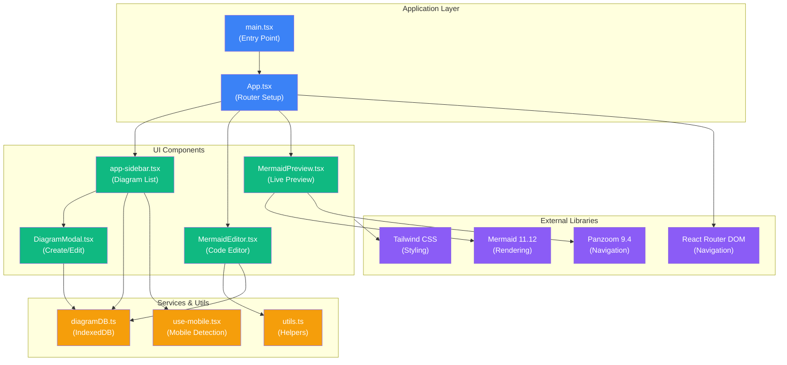

# Project Mermaid - Interactive Diagram Editor

## Project Architecture Flowchart



---

## Getting Started

### Installation

```bash
pnpm install
```

### Development

```bash
pnpm dev
```

### Build

```bash
pnpm build
```

### Preview

```bash
pnpm preview
```

### Lint

```bash
pnpm lint
```

## Tech Stack

- **React 19.1** with TypeScript
- **Vite 7.1** for fast development and building
- **React Router DOM 7.9** for client-side routing
- **Tailwind CSS** with shadcn/ui component library
- **Mermaid 11.12** for diagram rendering
- **Panzoom 9.4** for interactive diagram navigation
- **IndexedDB** for persistent client-side storage
- **React Compiler** enabled for automatic optimizations

## Key Features

- Real-time Mermaid diagram editor with live preview
- Interactive zoom and pan controls
- Multiple view modes: Preview-only, Editor-only, Split view
- Create, edit, rename, and delete diagrams
- Auto-save functionality (1 second after editing stops)
- Persistent storage using IndexedDB
- URL-based routing for individual diagrams
- Responsive design for mobile and desktop
- Modern UI with shadcn/ui components
